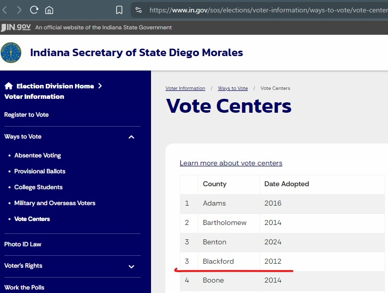

```{r setup, echo=FALSE}
library(dplyr)
library(ggplot2)
library(plotly)
#library(gganimate) # asks for gifski for gif or av for video
library(tidyr)
library(purrr)
library(readr)
library(stringr)
library(knitr)
library(kableExtra)
library(broom)
library(DT)

# to do
# decide on adoption_status and add it to import
# consider density/rurality? peer counties?
# for dashboard, pull stuff from in-person voting section

# clean up stuff? this is jsut my eda

# this might require more attention; omit package call if using more often (doubtful)
IN_counties <- sf::st_read("data/IN_counties.geojson", quiet = TRUE)

# set some to factors
reg_turnout <- read_csv("data/registration_turnout2010-2024.csv", show_col_types = FALSE) |> 
  mutate(pres_election_year = factor(pres_election_year))

# keep totals separate
reg_turnout_totals <- filter(reg_turnout, county == "Total")

reg_turnout <- filter(reg_turnout, county != "Total")

vote_centers <- read_csv("data/vote_center_adoption.csv", show_col_types = FALSE)

voting_stats <- left_join(reg_turnout, vote_centers, by = "county") |> 
  mutate(adoption_status = if_else(election_year >= replace_na(adoption_year, 2025),
                                   "Vote Center", "Precinct-based") |> 
           factor()) |> 
  filter(!(county == "Decatur" & election_year == 2022)) |> 
  select(election_year, adoption_year, adoption_status, contains("rate")) |> 
  pivot_longer(contains("rate")) |> 
  rename(x = value, y = adoption_status) |>
  nest(data = c(x, y), .by = c(election_year, name)) |> 
  # replace with z-test as this is bounded [0,1] !
  mutate(t_test =
           map(data, 
               \(x) broom::tidy(t.test(x ~ y, 
                                       data = x, 
                                       var.equal = FALSE,
                                       # default is 2-sided but specific argument here is that Vote Center will be higher;
                                       # but since estimate1 is precinct, we're testing that it's lower; else we could just refactor
                                       alternative = "less"))),
         n_vote_centers = map(data, filter, y == "Vote Center") |> 
           map_int(nrow),
         .by = c(election_year, name)
  ) |> 
  unnest(t_test) |> 
  mutate(stars = case_when(
    p.value < .001 ~ "***", 
    p.value < .01 ~ "**",
    p.value < .05 ~ "*",
    TRUE ~ "")) |> 
  select(-data)

reg_turnout_errors <- mutate(
  reg_turnout, 
  turnout_rate_calc = round(voting / registered * 100), 
  turnout_diff = turnout_rate - turnout_rate_calc,
  voting_calc = voting_in_person + voting_absentee, 
  voting_diff = voting - voting_calc,
  voting_absentee_rate_calc = round(voting_absentee / voting * 100),
  voting_absentee_rate_diff = round(voting_absentee_rate - voting_absentee_rate_calc),
  voting_diff_pct = voting_diff / voting) |> 
  filter(county != "Total" & (turnout_diff != 0 | voting_diff != 0 | 
                                voting_absentee_rate_diff != 0)) |> 
  # all match on turnout_rate and absentee rate, but not voting rate
  select(county, election_year, registered, voting_in_person, voting_absentee,
         voting, voting_calc, voting_diff, voting_diff_pct) |> 
  arrange(desc(election_year), county)

```

# Vote Centers and Turnout

## Row 1 {height="200px"}

```{r}
#| content: valuebox
list(
  title = "Indiana counties with vote centers",
  icon = "arrow-up-right", 
  value = nrow(vote_centers), 
  color = "light"
)
```

```{r}
#| content: valuebox
list(
  title = "Vote center impact (absentee, '24)",
  icon = "mailbox-flag", 
  value = paste0("+", 
                 filter(voting_stats, name == "voting_absentee_rate" & 
                          election_year == 2024) |> 
                   pull(estimate) |> 
                   (\(x) x * -1)() |> 
                   round(), 
                 "%"),
  color = "light"
)
```

```{r}
#| content: valuebox
list(
  title = "Vote center impact (overall turnout, '24)",
  icon = "arrows", 
  value = paste0(
    filter(voting_stats, name == "turnout_rate" & 
             election_year == 2024) |> 
      pull(estimate) |> 
      (\(x) x * -1)() |> 
      round(), 
    "%"),
  color = "light"
)
```

## Row {.flow height="220px"}

::: card
The plots in each tab below describe trends in overall voter turnout, by county and adoption status. *Click the expand icon at the bottom right of a plot to see it full-screen.*\
- **Vote center adoption and turnout** shows the average turnout (in-person and absentee) and vote center adoption since 2010. Despite an obvious increase in counties replacing precinct-based voting with vote centers, average turnout has not apparently increased and remains on par with counties with precincts.\
- **Presidential Elections** shows the county-level general turnout rates for presidential election years, with vote center adoption indicated by color and turnout indicated by intensity (i.e. darker cells are those years with higher general turnout).\
- **Mid-term Elections** shows the county-level general turnout rates for mid-term elections.\
- **The table** that follows describes both the average turnout rate depicted in the first plot and the absentee turnout, which includes in-person early and mail-in voting, among counties with precinct-based vs. vote centers and whether the differences are meaningful. Counties with vote centers tend to have higher absentee turnout rates but not general turnout rates, meaning more citizens may take advantage of early or mail-in voting.
:::

## Row 2 {.tabset height="400px"}

```{r, include=FALSE}
# replaced for being less than optimal
x <- left_join(reg_turnout, vote_centers, by = "county") |> 
  mutate(adoption_status = if_else(election_year >= replace_na(adoption_year, 2025),
                                   "Vote Center", "Precinct-based"), 
         Monroe = if_else(county == "Monroe", "Monroe", "Other counties")) |> 
  filter(!(county == "Decatur" & election_year == 2022)) 

p <- ggplot(x,
            aes(x = election_year, y = turnout_rate, group = county, 
                color = adoption_status)) +
  geom_line(alpha = .3) + 
  geom_jitter(aes(shape = Monroe), width = .025, height = .025,
              show.legend = FALSE) + 
  theme_minimal() +
  theme(legend.position = "bottom") +
  scale_y_continuous(limits = c(0, 100)) + 
  scale_x_continuous(limits = c(2009L, 2025L), 
                     breaks = seq(2008, 2024, by = 4)) +
  scale_color_manual(values = c("Vote Center" = "#ef8a62", 
                                "Precinct-based" = "#67a9cf")) +
  labs(x = "Election year", 
       y = "Turnout rate", 
       title = "Indiana County General Turnout Rate, 2010-2024, by adoption status",
       subtitle = "Monroe County highlighted",
       caption = "Decatur county (2022) excluded for odd values"
  )
ggplotly(p)
```

```{r adopt_turnout}
#| title: Vote center adoption & turnout
x <- left_join(reg_turnout, vote_centers, by = "county") |> 
  mutate(adoption_status = if_else(election_year >= replace_na(adoption_year, 2025),
                                   "Vote Center", "Precinct-based"), 
         Monroe = if_else(county == "Monroe", "Monroe", "Other counties"),
         # for plotting alphabetically from top
         county = forcats::fct_rev(factor(county)),
  ) |> 
  filter(!(county == "Decatur" & election_year == 2022)) |> 
  summarize(turnout_rate = mean(turnout_rate), 
            .by = c(adoption_status, election_year))

y <- count(vote_centers, adoption_year) |> 
  mutate(vote_centers = cumsum(n) / length(unique(IN_counties$name)) * 100 ) |> 
  rename(election_year = adoption_year)

y <- bind_rows(
  filter(y, election_year < 2011) |> 
    summarize(election_year = 2010, n = sum(n), vote_centers = max(vote_centers)),
  filter(y, election_year >= 2011)
)

p <- ggplot(x,
            aes(x = election_year, y = turnout_rate, group = adoption_status,
                color = adoption_status)) + 
  # add share of adoption
  geom_line(
    data = y,
    aes(x = election_year, y = vote_centers),
    color = "darkgrey", 
    linetype = 2,
    linewidth = 1.25,
    inherit.aes = FALSE) + 
  annotate("text", 
           x = 2013,
           y = 8, 
           label = "Share of counties with\nvote centers") + 
  geom_line(linewidth = 1.25) + 
  theme_minimal() +
  theme(legend.position = "bottom") +
  scale_y_continuous(limits = c(0, 100)) + 
  scale_x_continuous(breaks = seq(2010, 2024, by = 2), 
                     #limits = c(2010, 2024)
  ) +
  scale_alpha_continuous(range = c(0, 1)) + 
  scale_color_manual(values = c("Vote Center" = "#ef8a62", 
                                "Precinct-based" = "#67a9cf")) +
  labs(x = "Election year", 
       y = "Turnout rate",
       title = "Average General Turnout Rate, 2010-2024, by vote center adoption status",
  )

ggplotly(p)
```

```{r turnout_pres}
#| title: Presidential Elections
#| fig-width: 40
#| fig-height: 90

x <- left_join(reg_turnout, vote_centers, by = "county") |> 
  filter(pres_election_year == "Presidential elections") |> 
  mutate(adoption_status = if_else(election_year >= replace_na(adoption_year, 2025),
                                   "Vote Center", "Precinct-based"), 
         Monroe = if_else(county == "Monroe", "Monroe", "Other counties"),
         # for plotting alphabetically from top
         county = forcats::fct_rev(factor(county)),
  ) |> 
  filter(!(county == "Decatur" & election_year == 2022))

p <- ggplot(x,
            aes(x = election_year, 
                y = county,
                fill = adoption_status, 
                alpha = turnout_rate)) +
  geom_tile() + 
  theme_minimal() +
  theme(legend.position = "bottom", 
        line = element_blank()
        ) +
  scale_x_continuous(breaks = seq(2012, 2024, by = 4)) +
  scale_alpha_continuous(range = c(0, 1)) + 
  scale_fill_manual(values = c("Vote Center" = "#ef8a62", 
                               "Precinct-based" = "#67a9cf")) +
  labs(x = "Election year", 
       y = "County", 
       title = "Indiana General Presidential Turnout Rate, 2012-2024, by vote center adoption status",
  )

ggplotly(p)
```

```{r turnout_midterm}
#| title: Mid-term Elections
#| fig-width: 40
#| fig-height: 90

x <- left_join(reg_turnout, vote_centers, by = "county") |> 
  filter(pres_election_year == "Mid-term elections") |> 
  mutate(adoption_status = if_else(election_year >= replace_na(adoption_year, 2025),
                                   "Vote Center", "Precinct-based"), 
         Monroe = if_else(county == "Monroe", "Monroe", "Other counties"),
         county = forcats::fct_rev(factor(county)),
  ) |> 
  filter(!(county == "Decatur" & election_year == 2022))

p <- ggplot(x,
            aes(x = election_year, 
                y = county,
                fill = adoption_status, 
                alpha = turnout_rate)) +
  geom_tile() + 
  theme_minimal() +
  theme(legend.position = "bottom", 
        line = element_blank()) +
  scale_x_continuous(breaks = seq(2010, 2022, by = 4)) +
  scale_alpha_continuous(range = c(0, 1)) + 
  scale_fill_manual(values = c("Vote Center" = "#ef8a62", 
                               "Precinct-based" = "#67a9cf")) +
  labs(x = "Election year", 
       y = "County", 
       title = "Indiana General Mid-term Turnout Rate, 2010-2022, by vote center adoption status",
  )

ggplotly(p)
```

## Row 3 {height="300px"}

```{r table}
s <- seq(-5, 25, by = 5) / 100
v <- c("#f7fcf5", "#e5f5e0", "#c7e9c0", "#a1d99b", "#74c476", "#41ab5d", 
       "#238b45", "#005a32")

arrange(voting_stats, desc(election_year)) |> 
  mutate(name = if_else(grepl("turnout_rate", name),
                        "General Turnout", 
                        "Absentee Turnout"),
         across(contains("estimate"), \(x) x / 100),
         estimate = -1 * estimate) |> 
  select(`Election Year` = election_year, Metric = name, 
         `No. Vote Centers` = n_vote_centers, `Precinct-based` = estimate1, 
         `Vote Center` = estimate2, Difference = estimate) |> 
  datatable(fillContainer = FALSE, 
            extensions = "Buttons",
            options = list(buttons = c("pdf", "csv", "excel"), 
                           pageLength = 4, 
                           lengthMenu = c(4, 8, 16))
            ) |> 
  formatPercentage(columns = 4:6) |> 
  formatStyle(columns = 6,
              backgroundColor = styleInterval(cuts = s, values = v))


```


# Errors

In the course of this analysis a few potential data errors were identified.

First, the Indiana Secretary of State [website](https://www.in.gov/sos/elections/voter-information/ways-to-vote/vote-centers/) features a table that as of writing (2025-09-17) mistakenly lists the row number 3 twice, thereby undercounting the number of counties that have adopted vote centers. Several news sources ([BSquare Bulletin](https://bsquarebulletin.com/vote-centers-nixed-again-in-monroe-county-for-second-time-in-a-decade-and-a-half/) in May 2025, [Indiana Capital Chronicle](https://indianacapitalchronicle.com/briefs/vote-times-app-expands-beyond-indianapolis/) in October 2024) repeated the then-total as 65 when it should have been 66 (it is currently 68 as two counties, `r filter(vote_centers, adoption_year == 2025) |> pull(county) |> paste0(collapse = " and ")`, have been added since May 2025).

{fig-alt="A screenshot of the IN SoS Vote Center page" fig-align="center"}. 

Second, a number of tallies for the number of votes cast do not match when summed; some are higher and some are lower than reported. `voting_in_person` and `voting_absentee` ought to sum to `voting`, but this is not true for `r nrow(reg_turnout_errors)` cases. `voting_diff` shows the difference between what is reported (`voting`) and what is calculated (`voting_calc`) by summing `voting_in_person` and `voting_absentee`. 

Some differences may have arisen from simple data entry errors. Monroe county's 2010 `voting` count shows 36,**3**33 but summing the in-person and absentee counts yields 26,193 + 10,440 = 36,**6**33. It's plausible someone typed 6 twice or struck the adjacent 6 key on the numpad accidentally. Likewise with Wells county's 2010 or Cass county's 2012 tallies.

While most potential errors are relatively small, a few stand out. Decatur county's 2022 mid-term tallies simply do not add up and suggest unrealistic absentee voting rate (`r round(filter(reg_turnout_errors, county == "Decatur")$voting_diff_pct * 100, 1)`%) due to what is likely an incorrect number of total votes tallied, which is less than either Election Day turnout or absentee turnout. 

Ohio county's 2014 tallies may have substituted Election Day voting (`r format(filter(reg_turnout_errors, county == "Ohio")$voting_in_person, big.mark = ",")`) and voting totals (`r format(filter(reg_turnout_errors, county == "Ohio")$voting, big.mark = ",")`), as the in-person voting well exceeds the total number of votes. However, it is unclear where the 4,087 figure came from, as that would imply a very high general turnout of `r round(filter(reg_turnout_errors, county == "Ohio")$voting_in_person / filter(reg_turnout_errors, county == "Ohio")$registered * 100)`%. For context, the highest reported turnout is tied between `r paste(filter(reg_turnout, turnout_rate == max(turnout_rate))$county, collapse = " and ")` counties' `r unique(filter(reg_turnout, turnout_rate == max(turnout_rate))$election_year)` elections at `r  mean(filter(reg_turnout, turnout_rate == max(turnout_rate))$turnout_rate)`%.

## Row height {height="%"}
```{r}
s <- seq(-200, 25, 25) / 100

# e.g. https://rstudio.github.io/DT/010-style.html
v <- paste0("rgb(255, ", 
       seq(255, 0, length.out = length(s) + 1), ", ",
       seq(255, 0, length.out = length(s) + 1), ")") |> 
  rev()

# download not available?
datatable(reg_turnout_errors,
          caption = "Vote tally errors, 2010-2024",
          fillContainer = FALSE, 
          extensions = "Buttons",
    options = list(buttons = c("pdf", "csv", "excel"), 
                   pageLength = 7,
                   lengthMenu = c(7, 14, 100)
                   )
    ) |> 
  formatPercentage(columns = 9) |> 
  formatStyle(columns = 9, 
              backgroundColor = styleInterval(cuts = s, values = v))
```


# Data {scrolling="false"}

Find all the source and compiled data used for this dashboard by clicking this [link](https://github.com/bjdugan/Indiana_Voting/tree/d59632c7145cabbc25b9efad9a3eee7d2379d77c/data) or the GitHub icon above.\
- Voter registration and turnout [statistics](https://www.in.gov/sos/elections/voter-information/register-to-vote/voter-registration-and-turnout-statistics/) tables were scraped from PDF text and compiled into tables.\
- Indiana Vote Center adoption [data](https://www.in.gov/sos/elections/voter-information/ways-to-vote/vote-centers/) were scraped from the web.\
- Spatial data were gathered from the IndianaMap [API](https://www.indianamap.org/datasets/INMap::county-boundaries-of-indiana-current/about).

**Data glossary**

 - `election_year`: Election year. Extracted from PDFs.  
 - `county`: Name of the county. Extracted from PDFs.  
 - `registered`: The number of registered voters in a county. Extracted from PDFs.  
 - `voting`: The number of registered voters voting. Extracted from PDFs.  
 - `turnout_rate`: The share of registered voters voting. Extracted from PDFs.  
 - `voting_in_person`: The number of votes cast on Election Day in-person. Extracted from PDFs.  
 - `voting_absentee`: The number of votes cast early, by mail, etc. Extracted from PDFs.  
 - `voting_absentee_rate`: The share of registered voters who cast an absentee vote. Extracted from PDFs.  
 - `pres_election_year`: Whether the election is presidential or mid-term. Derived.  
 - `election_date`: Election date for a given year. Extracted from PDFs.  
 - `adoption_year`: Year the county adopted a vote center model over precinct-based voting model. Read from Secretary of State website.  
 - `adoption_status`: Whether the county has switched to vote center model or retains the precinct-based model. Derived.  

```{r}
#| title: Explore the full data set 
options(DT.options = list(bPaginate = TRUE,
                          # this controls table display and options
                          # https://datatables.net/reference/option/dom 
                          dom = "liftBp")) 

left_join(reg_turnout, vote_centers, by = "county") |> 
  mutate(adoption_status = if_else(election_year >= replace_na(adoption_year, 2025),
                                   "Vote Center", "Precinct-based")) |> 
  arrange(desc(election_year), county) |>
  datatable(fillContainer = FALSE, 
            extensions = "Buttons",
            options = list(buttons = c("pdf", "csv", "excel"), 
                           pageLength = 6, # 6 looks better on half-screen
                           lengthMenu = c(6, 24, 48) # options for more
            )
  )
```

```{=html}
<!-- 
Indiana Map (forthcoming)

A map of Indiana counties 

Monroe County (forthcoming)

Monroe County, Indiana, specific data
-->
```

# Public Comment

**Submission on 2025-05-18 for Public Comment on Vote Center Adoption in Monroe County, Indiana**

I am writing in support of the Vote Center Study Committee's [recommendation](https://bloomdocs.org/wp-content/uploads/simple-file-list/2025-03-06-VCSC-Report-Final-Draft-7_4-Apdx2.pdf?ref=bsquarebulletin.com) to increase early in-person voting, and with some reservations to replace precinct-based polling locations throughout Monroe County with vote centers. I have lived in Monroe County for nearly a decade and worked as both an Election Clerk (2020) and Election Judge (2024) and am grateful for the support and integrity the County provides with regard to elections.

Using publicly available summary [data](https://www.in.gov/sos/elections/voter-information/register-to-vote/voter-registration-and-turnout-statistics/) from the Indiana Secretary of State office spanning each presidential and mid-term election since 2010, I have found that\
- The shift to vote centers among Indiana counties coincides with an *increase* in *absentee voting* (including early in-person, by-mail, etc.) but **not in general turnout**, suggesting that - all other things being equal - there is little basis for the argument that residents would take advantage of being able to vote wherever they please on Election Day so much as having more time and days to vote;\
- In Monroe county in particular, the number of voters casting votes in presidential and mid-term elections has remained relatively consistent (about 60,000 in presidential election years) since 2010 despite the number of registered voters changing from a high of 112,000 in 2016 to 93,000 in 2024; i.e., there is possibly a set of motivated voters who vote in each election and would vote regardless of vote center adoption;

The Committee's recommendation to open three additional early voting centers is laudable and welcome. I have taken advantage of early voting and personally believe it effectively alleviates concerns about precinct-based Election Day voting (e.g. someone arrives too late at the wrong location or someone cannot take time to vote).

This may all become moot as the result of [House Bill 1633](https://iga.in.gov/legislative/2025/bills/house/1633/details), which charges the Secretary of State to report on scheduling and feasibility of vote centers by early November, 2025, but the argument that vote center adoption makes it easier for people to vote in general does not appear to be supported by counties that have made the switch. Perhaps fine-grain data from other counties would paint a different picture.

-Brendan Dugan

Data and code available here: <https://github.com/bjdugan/Indiana_Voting>
